# Ảnh chụp thật của các địa danh

Đã đối chiếu địa danh qua mô tả nguồn và xem trực quan từng ảnh. Tệp ảnh lưu trong frontend/public/images/destinations; dữ liệu nguồn nằm ở backend/data/destination-photos.json.

Mở trang `/images/destinations/credits.html` trên web để xem đủ ảnh, tác giả, nguồn và giấy phép.

## Hồ Hoàn Kiếm

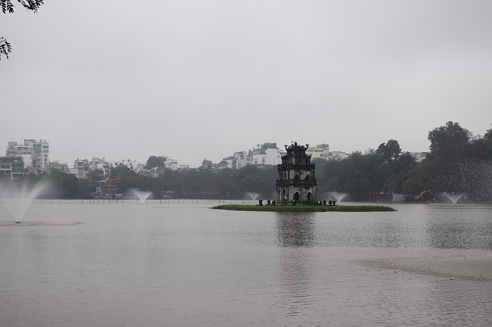

Ảnh: Mig Gilbert from Brighton. [The Turtle Tower (39558135494).jpg](https://commons.wikimedia.org/wiki/File:The_Turtle_Tower_(39558135494).jpg) · [CC BY-SA 2.0](https://creativecommons.org/licenses/by-sa/2.0).

## Văn Miếu - Quốc Tử Giám

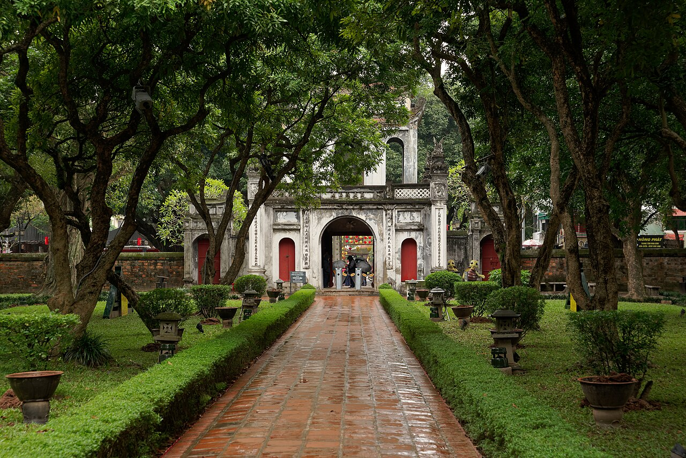

Ảnh: Jakub Hałun. [Main gate of the Temple of Literature, Hanoi, Vietnam, 20240123 0929 3068.jpg](https://commons.wikimedia.org/wiki/File:Main_gate_of_the_Temple_of_Literature,_Hanoi,_Vietnam,_20240123_0929_3068.jpg) · [CC BY 4.0](https://creativecommons.org/licenses/by/4.0).

## Hoàng thành Thăng Long

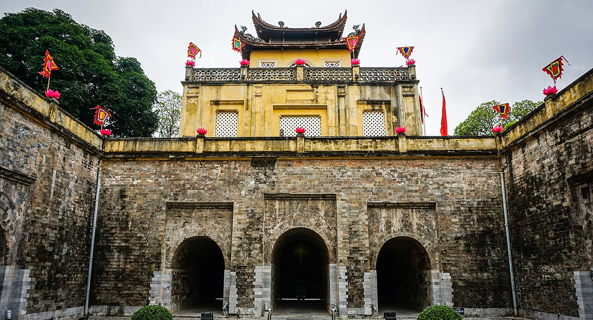

Ảnh: katiebordner. [Central Sector of the Imperial Citadel of Thang Long - Hanoi.jpg](https://commons.wikimedia.org/wiki/File:Central_Sector_of_the_Imperial_Citadel_of_Thang_Long_-_Hanoi.jpg) · [CC BY 2.0](https://creativecommons.org/licenses/by/2.0).

## Bảo tàng Dân tộc học Việt Nam

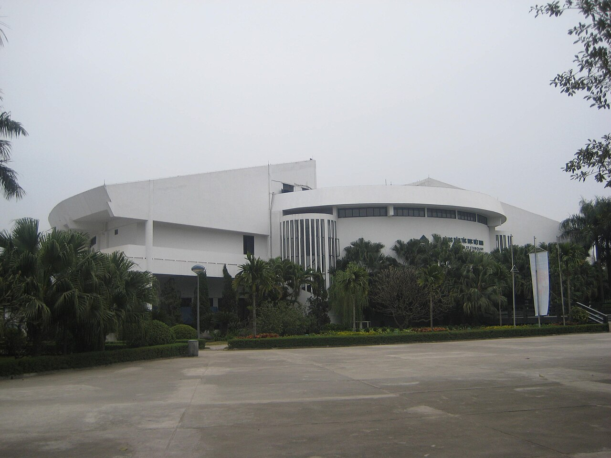

Ảnh: Nam Hy Hoàng Phong. [Trống Đồng building, Vietnam Museum of Ethnology.jpg](https://commons.wikimedia.org/wiki/File:Tr%E1%BB%91ng_%C4%90%E1%BB%93ng_building,_Vietnam_Museum_of_Ethnology.jpg) · [CC BY 3.0](https://creativecommons.org/licenses/by/3.0).

## Phố ẩm thực Tạ Hiện

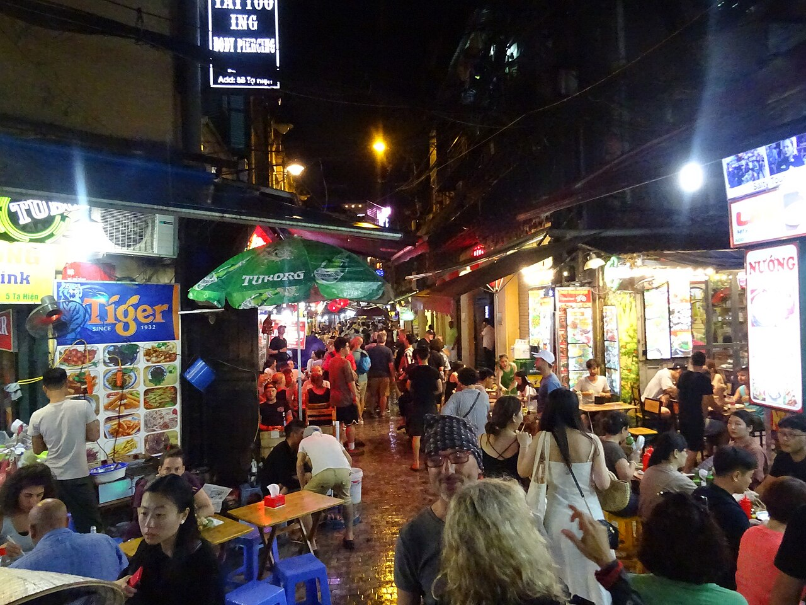

Ảnh: Christophe95. [Tạ Hiện Street.jpg](https://commons.wikimedia.org/wiki/File:T%E1%BA%A1_Hi%E1%BB%87n_Street.jpg) · [CC BY-SA 4.0](https://creativecommons.org/licenses/by-sa/4.0).

## Bãi biển Mỹ Khê

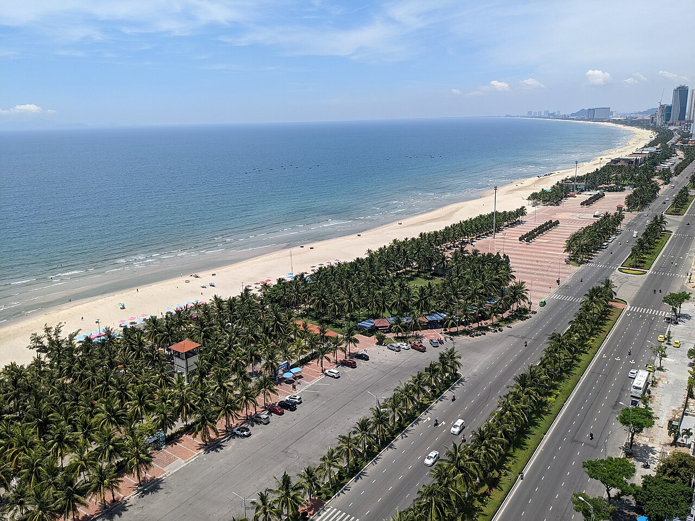

Ảnh: Jpatokal. [My Khe Beach Danang Coastline.jpg](https://commons.wikimedia.org/wiki/File:My_Khe_Beach_Danang_Coastline.jpg) · [CC BY-SA 4.0](https://creativecommons.org/licenses/by-sa/4.0).

## Danh thắng Ngũ Hành Sơn

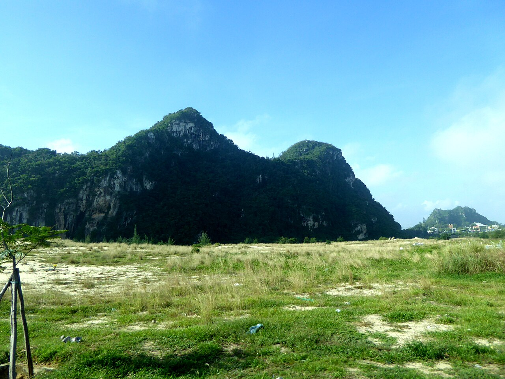

Ảnh: Hiroki Ogawa. [The Marble Mountains Da Nang Viet Nam - panoramio.jpg](https://commons.wikimedia.org/wiki/File:The_Marble_Mountains_Da_Nang_Viet_Nam_-_panoramio.jpg) · [CC BY 3.0](https://creativecommons.org/licenses/by/3.0).

## Chùa Linh Ứng Sơn Trà

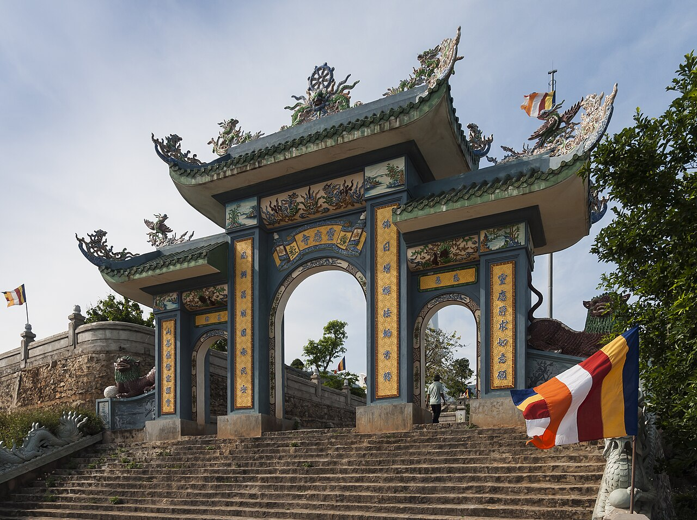

Ảnh: CEphoto, Uwe Aranas. [Son-Tra-Peninsula Da-Nang Vietnam Linh-Ung-Pagoda-01.jpg](https://commons.wikimedia.org/wiki/File:Son-Tra-Peninsula_Da-Nang_Vietnam_Linh-Ung-Pagoda-01.jpg) · [CC BY-SA 3.0](https://creativecommons.org/licenses/by-sa/3.0).

## Cầu Rồng Đà Nẵng

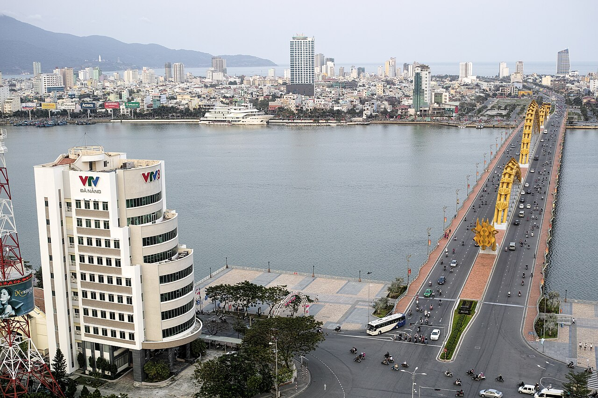

Ảnh: Person-with-No Name. [Da Nang Dragon Bridge.jpg](https://commons.wikimedia.org/wiki/File:Da_Nang_Dragon_Bridge.jpg) · [CC BY 2.0](https://creativecommons.org/licenses/by/2.0).

## Chợ Hàn Đà Nẵng

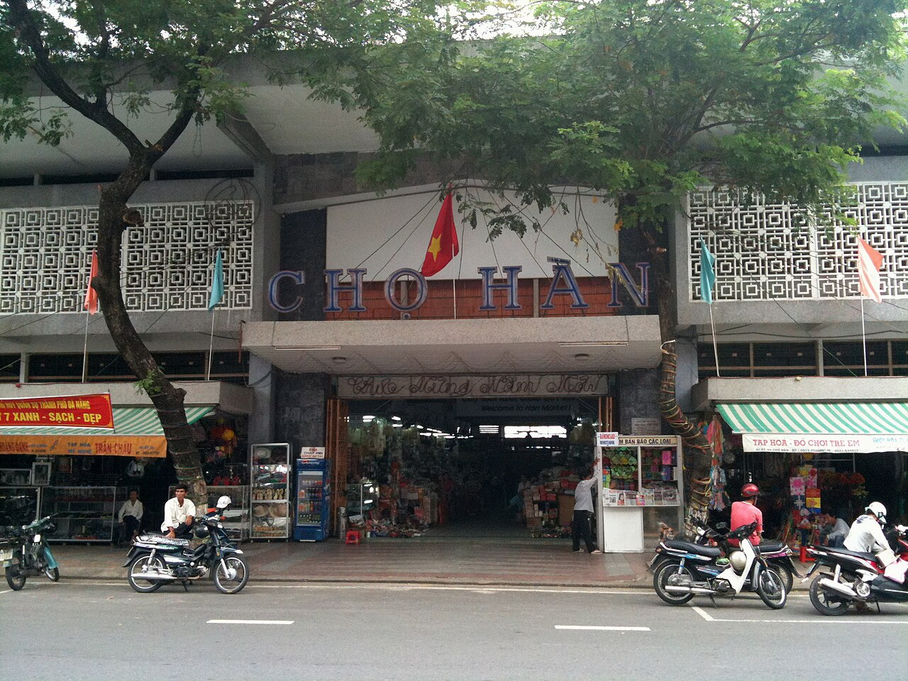

Ảnh: Dragfyre. [Cho Han Entrance.JPG](https://commons.wikimedia.org/wiki/File:Cho_Han_Entrance.JPG) · [CC BY-SA 3.0](https://creativecommons.org/licenses/by-sa/3.0).

## Dinh Độc Lập

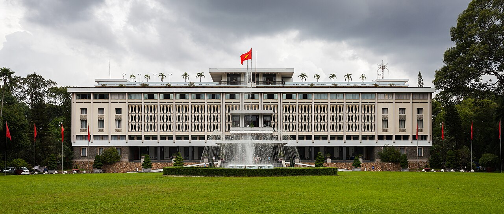

Ảnh: Diego Delso. [Palacio de la Reunificación, Ciudad Ho Chi Minh, Vietnam, 2013-08-14, DD 03.JPG](https://commons.wikimedia.org/wiki/File:Palacio_de_la_Reunificaci%C3%B3n,_Ciudad_Ho_Chi_Minh,_Vietnam,_2013-08-14,_DD_03.JPG) · [CC BY-SA 3.0](https://creativecommons.org/licenses/by-sa/3.0).

## Bảo tàng Chứng tích Chiến tranh

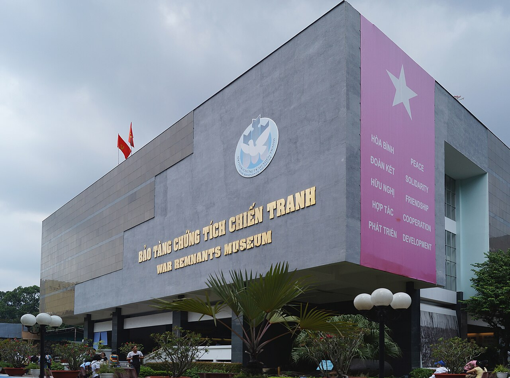

Ảnh: Prenn. [War Remnants Museum, HCMC, front.JPG](https://commons.wikimedia.org/wiki/File:War_Remnants_Museum,_HCMC,_front.JPG) · [CC BY-SA 3.0](https://creativecommons.org/licenses/by-sa/3.0).

## Chợ Bến Thành

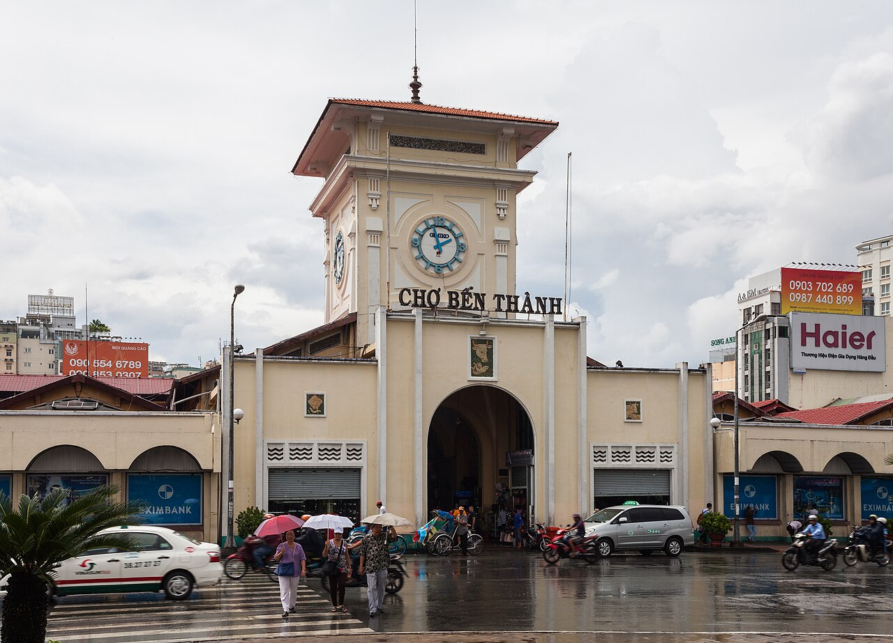

Ảnh: Diego Delso. [Ben Thanh, Ciudad Ho Chi Minh, Vietnam, 2013-08-14, DD 01.JPG](https://commons.wikimedia.org/wiki/File:Ben_Thanh,_Ciudad_Ho_Chi_Minh,_Vietnam,_2013-08-14,_DD_01.JPG) · [CC BY-SA 3.0](https://creativecommons.org/licenses/by-sa/3.0).

## Phố đi bộ Nguyễn Huệ

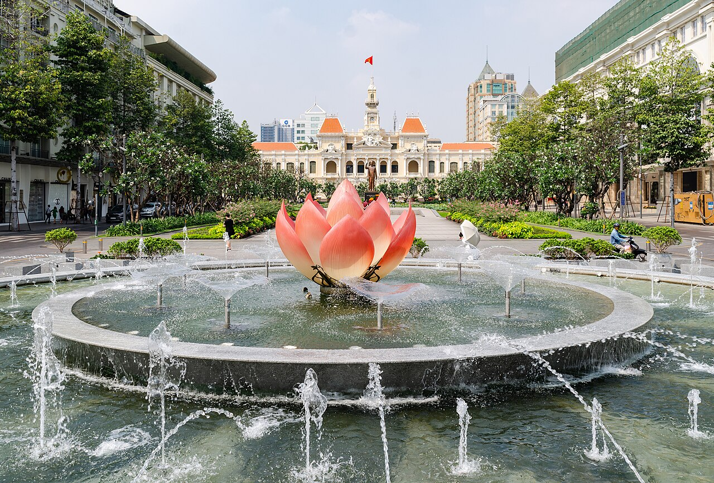

Ảnh: Steffen Schmitz (more photos). [Ho Chi Minh City, Nguyen Hue Street, 2020-01 CN-04.jpg](https://commons.wikimedia.org/wiki/File:Ho_Chi_Minh_City,_Nguyen_Hue_Street,_2020-01_CN-04.jpg) · [CC BY-SA 4.0](https://creativecommons.org/licenses/by-sa/4.0).

## Bưu điện Trung tâm Sài Gòn

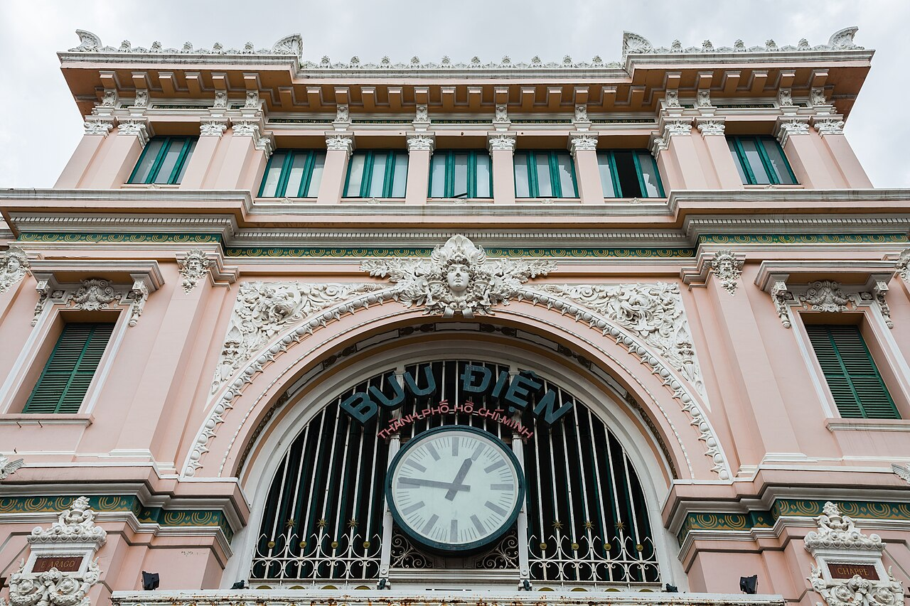

Ảnh: Diego Delso. [Oficina Central de Correos, Ciudad Ho Chi Minh, Vietnam, 2013-08-14, DD 06.JPG](https://commons.wikimedia.org/wiki/File:Oficina_Central_de_Correos,_Ciudad_Ho_Chi_Minh,_Vietnam,_2013-08-14,_DD_06.JPG) · [CC BY-SA 3.0](https://creativecommons.org/licenses/by-sa/3.0).

## Hà Giang

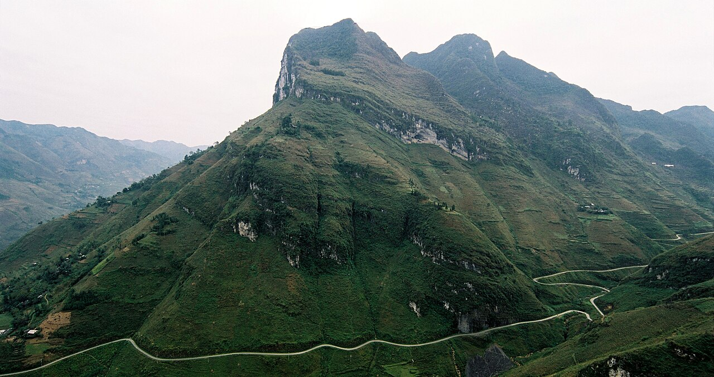

Ảnh: Khánh Hmoong. [Ma Pi Leng Pass winding road Ha Giang Vietnam.jpg](https://commons.wikimedia.org/wiki/File:Ma_Pi_Leng_Pass_winding_road_Ha_Giang_Vietnam.jpg) · [CC BY 2.0](https://creativecommons.org/licenses/by/2.0).

## Hội An

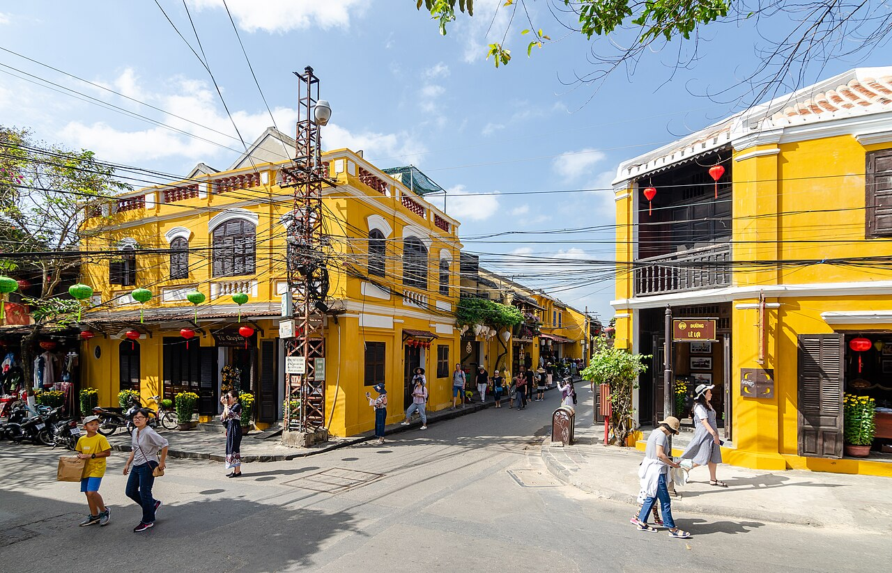

Ảnh: Steffen Schmitz (more photos). [Hội An, Ancient Town, 2020-01 CN-06.jpg](https://commons.wikimedia.org/wiki/File:H%E1%BB%99i_An,_Ancient_Town,_2020-01_CN-06.jpg) · [CC BY-SA 4.0](https://creativecommons.org/licenses/by-sa/4.0).

## Ninh Bình

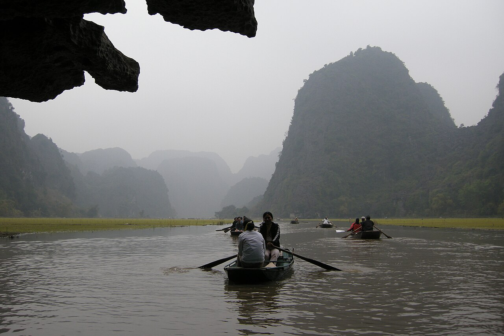

Ảnh: Vyacheslav Argenberg. [Vietnam, Ninh Binh, Trang An River.jpg](https://commons.wikimedia.org/wiki/File:Vietnam,_Ninh_Binh,_Trang_An_River.jpg) · [CC BY 4.0](https://creativecommons.org/licenses/by/4.0).

## Đà Lạt

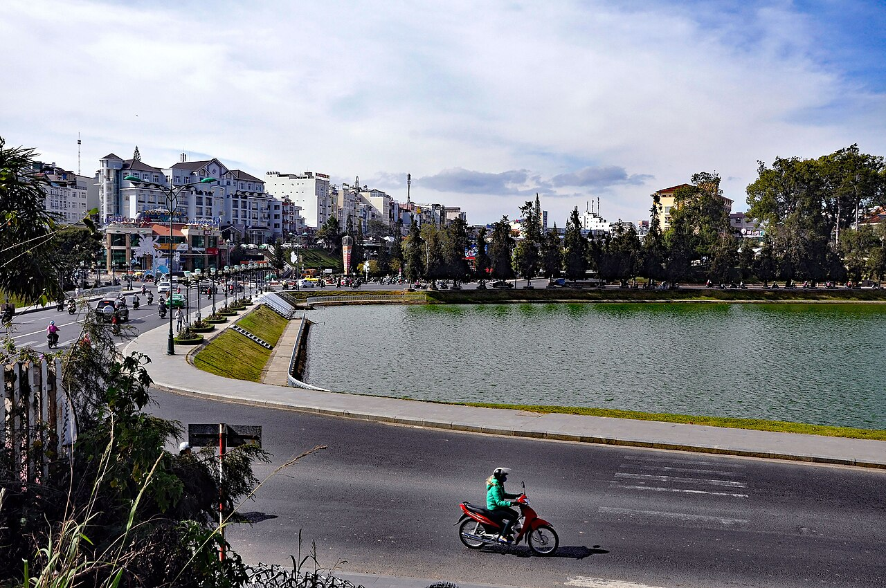

Ảnh: P. Hughes. [Da Lat - Xuan Huong Lake.jpg](https://commons.wikimedia.org/wiki/File:Da_Lat_-_Xuan_Huong_Lake.jpg) · [CC BY 4.0](https://creativecommons.org/licenses/by/4.0).

## Cập nhật database

Chạy từ thư mục backend:

```powershell
npm run photos:preview
npm run photos:import
```

Import thay ảnh seed chung bằng ảnh đúng địa danh, giữ ảnh người dùng đã tải lên và không lấy trạng thái ảnh chính của chúng. Bản ghi trùng tên hoặc không có trong database được bỏ qua; chạy lại không tạo ảnh trùng. Seed mới dùng cùng danh sách ảnh thật, không chọn ảnh luân phiên. Import kiểm tra tệp ảnh trước khi ghi, chạy trong một transaction và không sửa tọa độ, giá vé hay lịch trình.
